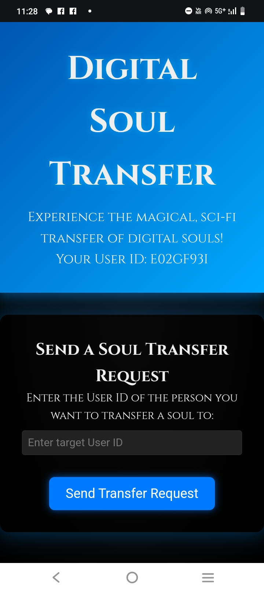

# Sigil (Digital Soul Transfer)



A magical, sci‑fi inspired website that lets you "transfer" digital souls between users – all in good fun! With neon glows, animated effects, and a mysterious vibe, this playful project simulates the process of a digital soul transfer.

## Overview

Digital Soul Transfer is a single‑page web application built with HTML, CSS, and JavaScript. When you visit the site, a unique user ID is automatically generated for you. You can send a soul transfer request to another user by entering their ID. Once the request is accepted, you select which soul to transfer (your own or an alternative soul) and, upon clicking the Transfer button, an immersive video plays. After the video finishes, a warning is shown that the soul cannot be recovered unless returned.

## Features

- **Random User ID Generation:** Every visitor gets a unique 8‑character ID on page load.
- **Transfer Request Workflow:** Send and simulate acceptance of a transfer request.
- **Soul Selection:** Choose between transferring your own soul or another soul.
- **Automatic Video Playback:** A designated video auto‑plays to simulate the transfer.
- **Warning Message:** Displays a caution that the transferred soul cannot be recovered unless returned.
- **Sci‑Fi Magical Theme:** Enjoy a dark, neon‑glowing, futuristic design.

## Technologies Used

- HTML5
- CSS3
- JavaScript

## How to Run Locally

### Prerequisites

- A modern desktop browser (Chrome, Firefox, Safari, etc.)
- (Optional) A local development server (e.g., [Python’s HTTP server](https://docs.python.org/3/library/http.server.html)) for best results

### Steps

1. **Clone the Repository**

   Open your terminal and run:

   ```bash
   git clone https://github.com/yourusername/digital-soul-transfer.git
